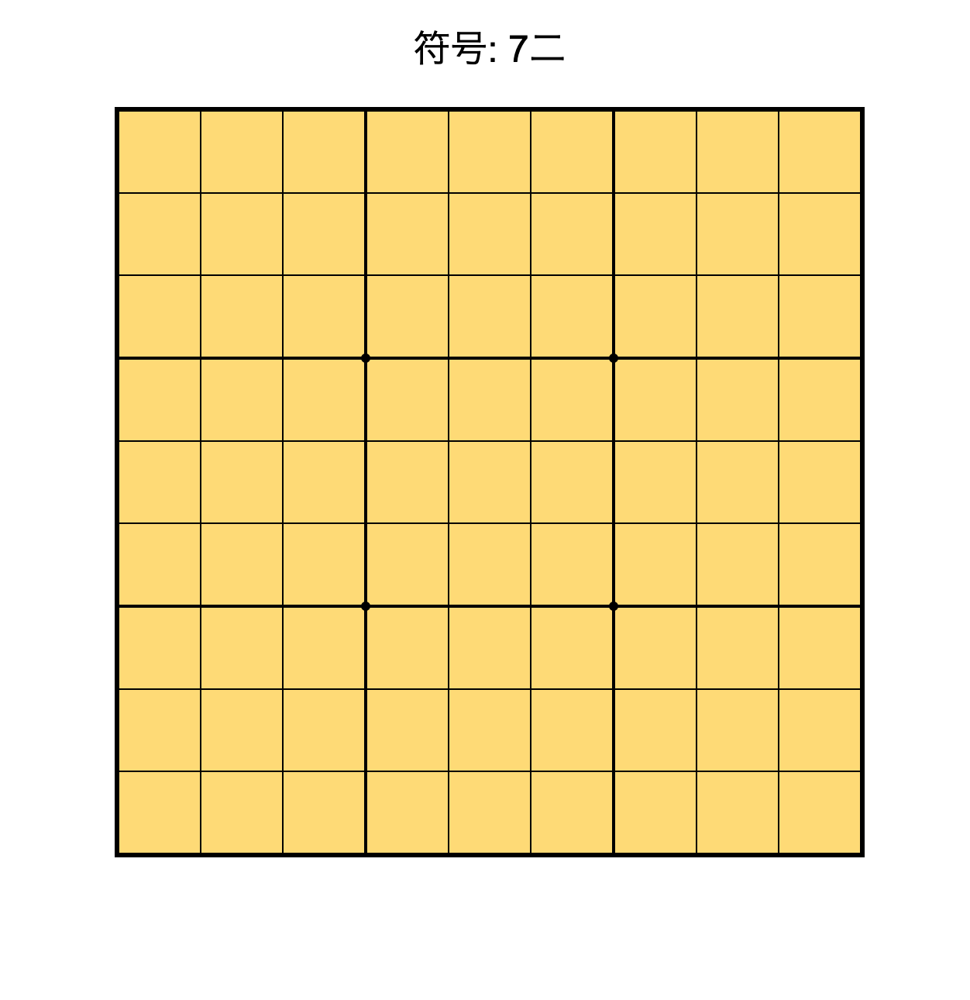
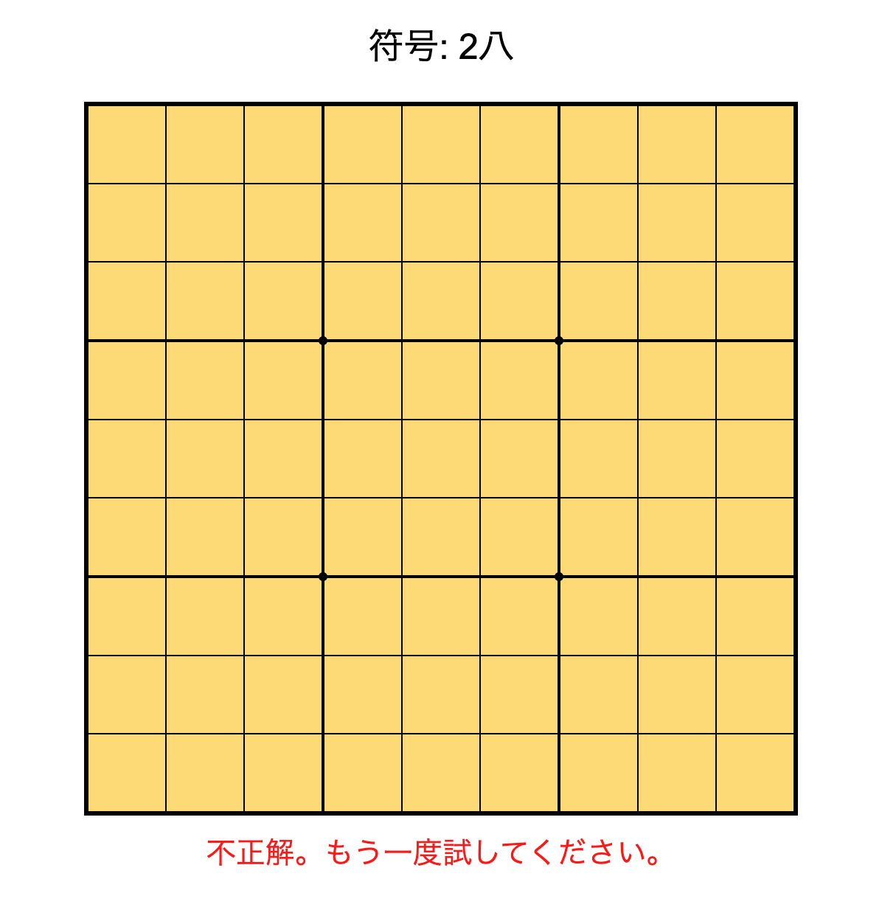

# 将棋符号練習アプリ

## 概要

このアプリは、将棋の符号（例: 7六、5三 など）をランダムに出題し、対応するマスをクリックして答えることで、符号の読み方を練習できるWebアプリです。

## 特徴

- 9×9の将棋盤を表示
- 盤の列は「1〜9」、行は「一〜九」の符号で表記
- ランダムに符号が出題され、正しいマスをクリックすると次の問題へ進む
- 正解・不正解のフィードバック表示

<!-- ## 画面イメージ

 -->

## 使い方

1. `index.html` をブラウザで開きます。
2. 画面上部に表示された符号（例: 7六）に対応するマスをクリックします。
3. 正解なら「正解！」、不正解なら「不正解。もう一度試してください。」と表示されます。
4. 正解すると自動で次の問題が出題されます。

## ファイル構成

- `index.html` : アプリ本体のHTML
- `styles.css` : 盤面やUIのスタイル
- `script.js` : 盤面生成・出題・判定などのロジック

## ライセンス

MIT License
